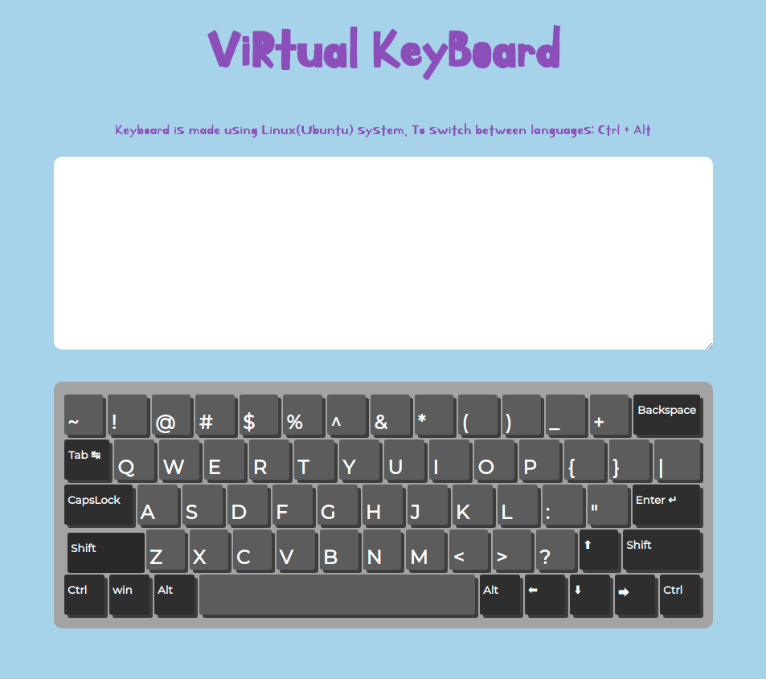

# Virtual Keyboard

Deployed to Git-Hub Pages: [https://nkvch.github.io/virtual-keyboard/](https://nkvch.github.io/virtual-keyboard/)

To play around with keyboard just open the `index.html` which is in the root directory in `source` branch.

### Cloning project

`https://github.com/nkvch/virtual-keyboard`

#### Install dependencies

`npm install`

### Keyboard is made using:

- VanillaJS <3
- Sass for styling

